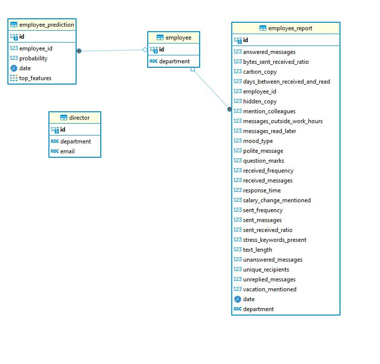

# Backend

### У backend-части имеются следующие эндпоинты:
- **getPredict**: соответствует post запросу по адресу ``http://{ip}/api/send-data``. В теле передается json с данными, необходимыми для получения прогноза.
- **getPredictsById**: соответствует get запросу по адресу ``http://{ip}/api/persons?id={id}``, в кач-ве параметра передается id сотрудника. В ответе возвращаются все прогнозы по данному сотруднику для построения графика.
- **getRecentPredicts**: соответствует запросу ``http://{ip}/api/get-history``. В ответе содержатся все даты, когда строились прогнозы. Нужен для получения прогноза полученного ранее.
- **getPredictByDate**: соответствует запросу ``http://{id}/api/get-predict-by-date?selected_table={date}``, в кач-ве параметра передается временная метка. В ответе присылается прогноз за эту дату.
- **sendReportsToDirectors**: соответствует запросу ``http://{}/api/send-report``. В кач-ве ответа приходит 200, если все сообщения отправились руководителям. 500 если произошла ошибка.

Все данные для прогноза и сами прогнозы сохраняются в  Базу данных для дальнейшего использования.

### Структура базы данных:

**Назад в [Документацию](../Документация.md)**
