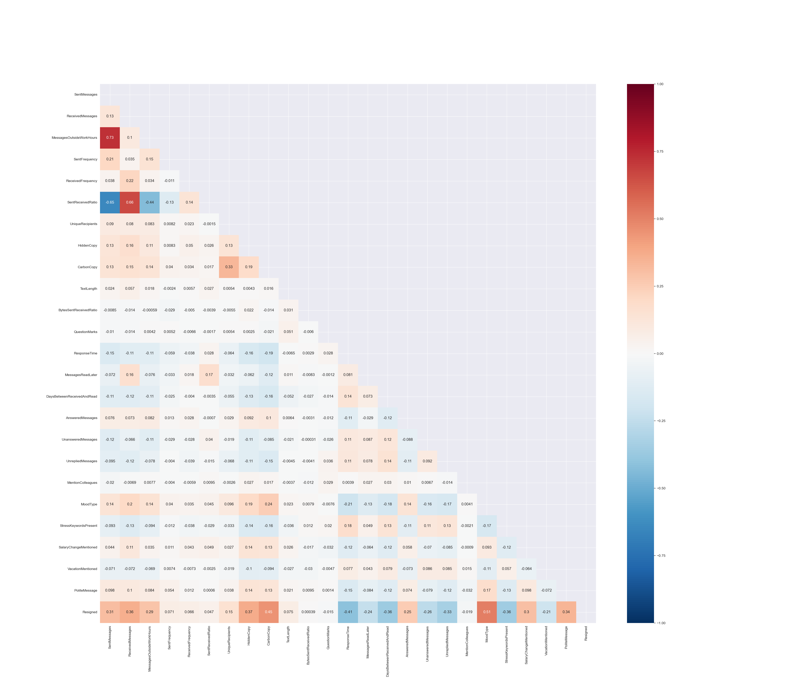

# Синтетика данных

Данные отражают более-менее реалистичную ситуацию по увольнениям сотрудников и причинам этого.
## Общая информация о данных:
Данные представляют из себя таблицу со статистикой работы с корпоративной электронной почты уникальных сотрудников.
- Сгенерировано 3000 синтетических данных
- Каждому сотрудника присвоен уникальный ID 
- Уволившихся 20%, Не уволившихся 80%
- Для теста сгенерировано 3 csv файла (``test_1.csv, test_2.csv, test_3.csv``). Каждый из них имеет различную информацию по двадцати одинаковым сотрудникам
## Структура данных
Данную структуру должен иметь каждый загружаемый csv файл.

| Название признака          | Описание признака                                                       | Распределение признака | Формат значений | 
| -------------------------- | ----------------------------------------------------------------------- | ---------------------- | --------------- | 
| id                         | Уникальное ID пользователя                                              | -                      | int             |
| SentMessages               | Количество отправленных сообщений                                       | Пуассона               | int             | 
| ReceivedMessages           | Количество полученных сообщений                                         | Пуассона               | int             | 
| MessagesOutsideWorkHours   | Количество сообщений, отправленных вне рабочего дня                     | Пуассона               | int             | 
| SentFrequency              | Частота отправки                                                        | Пуассона               | int             | 
| ReceivedFrequency          | Частота получения                                                       | Пуассона               | int             |
| SentReceivedRatio          | Соотношение количества полученных и отправленных сообщений              | Равномерное            | float           | 
| UniqueRecipients           | Количество адресатов в отправляемых сообщениях                          | Пуассона               | int             |  
| HiddenCopy                 | Количество сообщений с адресатами в поле «скрытая копия»                | Экспоненциальное       | int             |  
| CarbonCopy                 | Количество сообщений с адресатами в поле «копия»                        | Экспоненциальное       | int             |  
| TextLength                 | Количество символов текста в исходящих сообщениях                       | Логнормальное          | int             |   
| BytesSentReceivedRatio     | Соотношение объема в байтах получаемых и отправляемых сообщений         | Равномерное            | float           |  
| QuestionMarks              | Количество знаков вопроса                                               | Равномерное            | int             | 
| AnsweredMessages           | Количество сообщений, на которые пользователь получил ответ             | Нормальное             | int             |  
| UnansweredMessages         | Количество сообщений, на которые сотрудник не получил ответа            | Нормальное             | int             |  
| UnrepliedMessages          | Количество сообщений, на которые сотрудник сам не ответил               | Нормальное             | int             | 
| MentionColleagues          | Количество упоминаний коллег                                            | Нормальное             | int             | 
| SalaryChangeMentioned      | Указание информации о изменении зарплаты                                | Случайное              | int             |  
| VacationMentioned          | Указание информации об отпуске                                          | Случайное              | int             | 
| PoliteMessage              | Является ли сообщение вежливым?                                         | Случайное              | int             |  
| MoodType                   | Настроение в сообщении                                                  | Случайное              | int             | 
| StressKeywordsPresent      | Количество стрессовых слов в письме                                     | Нормальное             | int             |  
| ResponseTime               | Среднее время ответа на входящие сообщения                              | Нормальное             | int             | 
| MessagesReadLater          | Количество сообщений, прочитанных спустя 4 часа и более после получения | Нормальное             | int             |  
| DaysBetweenReceivedAndRead | Количество дней между получением и прочтением письма                    | Нормальное             | int             |  
| Group                      | Департамент, в котором работает пользователь                            | -                      | str             |  

## Корреляция признаков
Данные признаки коррелируют друг с другом следующим образом:

Наибольшее связь с целевой переменной показывают следующие признаки:
1. **MoodType** -Настроение в сообщении
2. **ResponseTime** - Среднее время ответа на входящие сообщения
3. **CarbonCopy** - Количество сообщений с адресатами в поле «копия»    
4. **DaysBetweenReceivedAndRead** - Количество дней между получением и прочтением письма 
5. **StressKeywordsPresent** - Количество стрессовых слов в письме

В целом, это отображает более-менее реалистичную картину.

**Назад в [Документацию](../Документация.md)**
