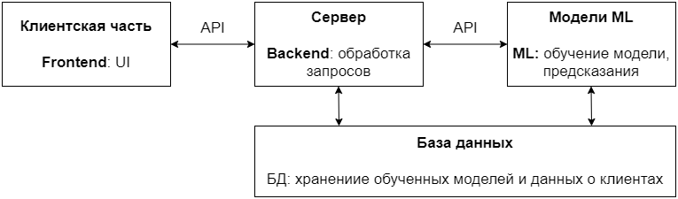

# LayoffsServicePrediction
Хакатон "Лидеры Цифровой промышленности"

## Задача:
Реализовать сервис прогнозирования увольнения на основе вовлеченности сотрудника

## Обзор Frontend части:
будет чуть позже

## Обзор Frontend части:
будет чуть позже

## Обзор ML части:
будет чуть позже

## Обзор базы данных:
В качестве базы данных используется PostgreSQL.
Для запуска использовать:
```bash
docker-compose build
docker-compose up -d
```
## Примерное описание архитектуры:


