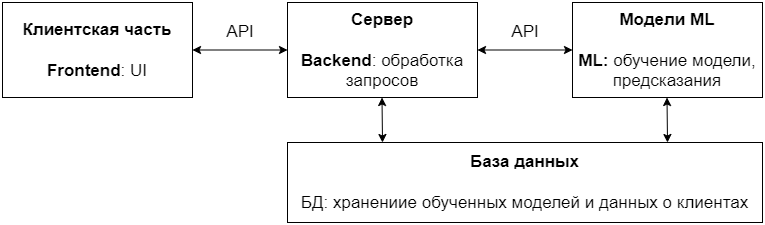

# LayoffsServicePrediction
Хакатон "Лидеры Цифровой Трансформации"

## Задача:
Реализовать сервис прогнозирования увольнения на основе вовлеченности сотрудника

## Запуск приложения:
Все сервисы упакованы в docker контейнеры.
1. Собрать docker контейнер: ```docker-compose build```
2. Запустить приложение: ```docker-compose up -d```

Чтобы остановить приложение: ```docker-compose stop```


## Обзор Frontend части:
будет чуть позже

## Обзор Frontend части:
будет чуть позже

## Обзор ML части:
ML-сервис упакован в docker-container. Запуск происходит автоматически при 
вводе комманды ```docker-compose up -d```

**Запуск приложения FastAPI (ручной):**
1. Создайте виртуальную среду: ```python -m venv venv```
2. Активируйте виртуальное окружение: ```venv\Scripts\activate```
3. Установите необходимые модули: ```pip install -r requirements.txt```
4. Перейдите в директорию ML: ```cd ML```
5. Запустите сервер: ```uvicorn app:app --host 0.0.0.0 --port 8889 --reload```

## Обзор базы данных:
В качестве базы данных используется PostgreSQL.

## Примерное описание архитектуры:


